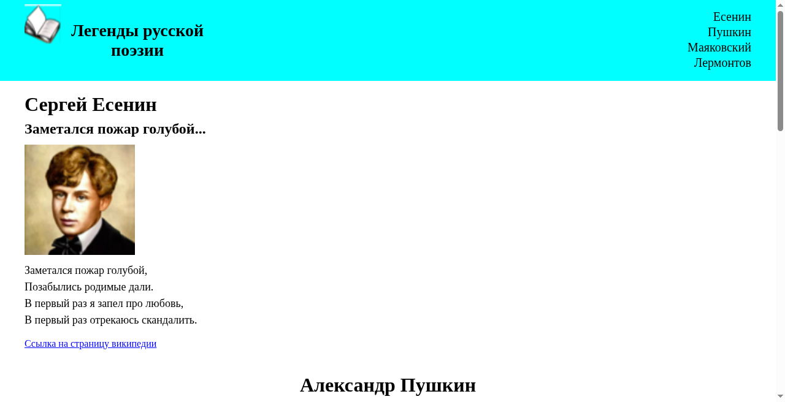
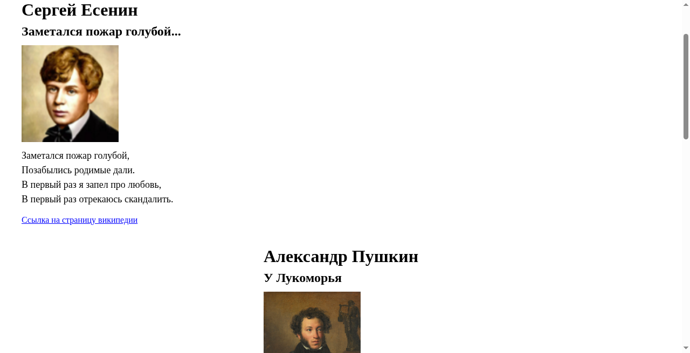
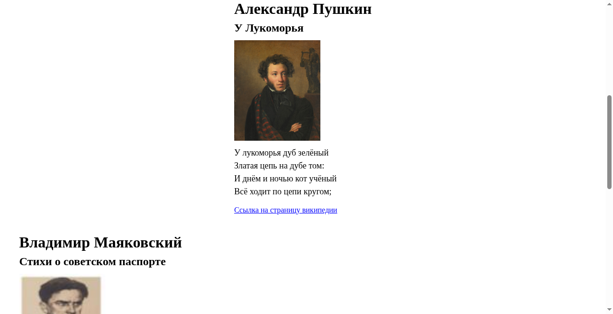
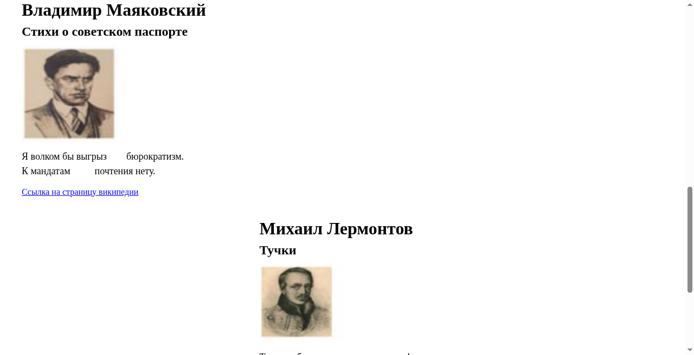
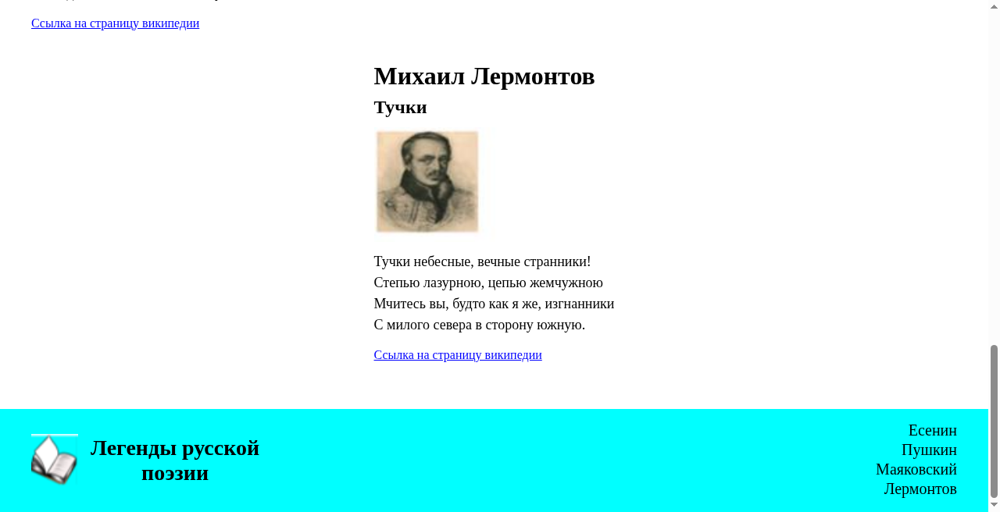

# Лабораторная работа 1. Основы верстки

Статус: **готово**

Одностраничный учебный сайт «Легенды русской поэзии» на **чистом HTML и CSS** (без JavaScript и фреймворков).

**Автор:** Артём Скопенков · группа **ИС2-241-ОБ**

🌐 [Открыть сайт](https://furfantom1331fur.github.io/Web-Design/lab1/)

[← Все лабораторные](../index.html)

---

## О сайте

Сайт посвящён четырём поэтам русской литературы. На одной странице расположены:

1. **Сергей Есенин** — «Заметался пожар голубой...»
2. **Александр Пушкин** — «У Лукоморья»
3. **Владимир Маяковский** — «Стихи о советском паспорте»
4. **Михаил Лермонтов** — «Тучки»

У каждого блока: портрет, фрагмент стихотворения и ссылка на страницу Википедии.

---

## Как сделан сайт

### Технологии
- **HTML5** — структура страницы (`index.html`)
- **CSS3** — оформление (`style/style.css`)
- Шрифт: `Times New Roman`
- Язык страницы: `lang="ru"`
- Title вкладки: `Лабораторная работа 1`

### Структура файлов

```
lab1/
├── index.html
├── style/
│   └── style.css
├── src/                 # логотип и портреты
├── screenshots/         # скриншоты готовой страницы
├── Otchet_Lab1_Web-Dizayn.docx
└── README.md
```

### Шапка и подвал
- Фон `cyan`
- Слева: логотип (открытая книга) + название «Легенды русской поэзии»
- Справа: вертикальное меню с якорными ссылками  
  `#esenin` · `#pushkin` · `#mayakovsky` · `#lermontov`
- В шапке у логотипа сдвиг `margin-top: -50px` (в подвале без сдвига)
- Подвал повторяет шапку по компоновке

### Основная часть
- Контейнер `main.main` с отступами
- Четыре секции с классом `poet` и своим `id`
- Общие стили секции: `h1` 32px, `h2` 24px, картинка 180px, текст 18px
- **Есенин** и **Маяковский** — прижаты влево
- **Пушкин** и **Лермонтов** — колонка по центру (`width: max-content`, `margin: auto`), текст внутри слева

### Навигация
Меню в шапке и подвале ведёт к секциям через якоря — страница остаётся одностраничной.
Вверху страницы — панель перехода между лабораторными.

---

## Скриншоты

### Шапка и Есенин


### Сергей Есенин


### Александр Пушкин


### Владимир Маяковский


### Михаил Лермонтов и подвал


### Подвал


---

## Отчёт

📄 [Otchet_Lab1_Web-Dizayn.docx](./Otchet_Lab1_Web-Dizayn.docx) — отчёт по лабораторной работе № 1

---

## Как открыть локально

1. Скачай репозиторий
2. Открой `lab1/index.html` в браузере
