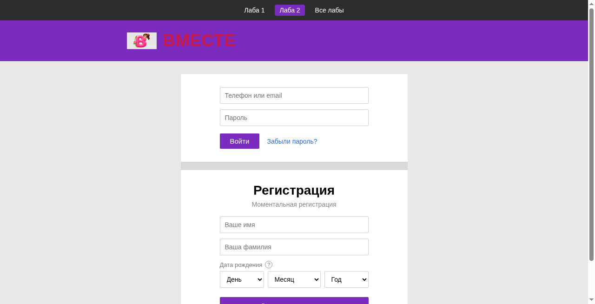
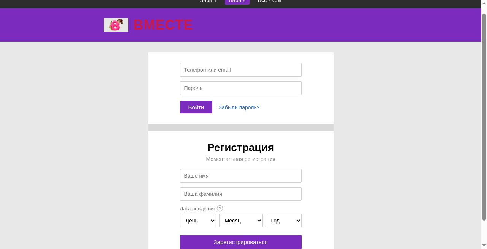
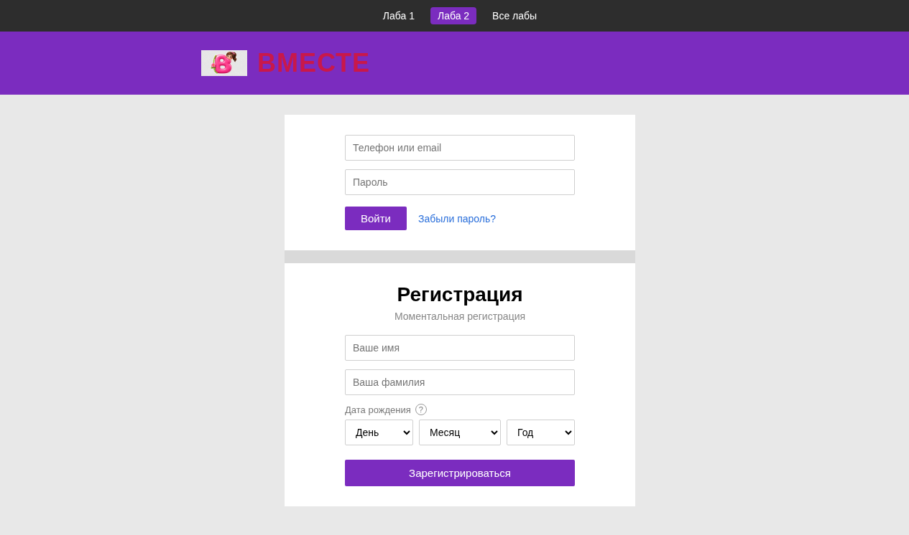
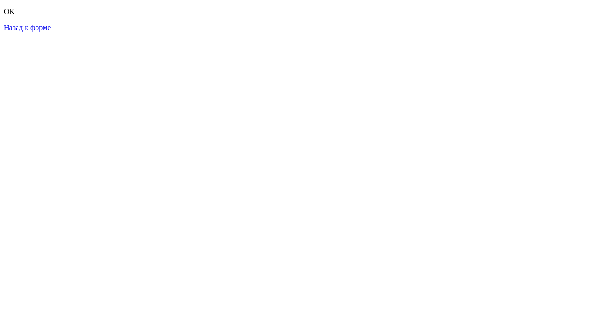

# Лабораторная работа № 2. Работа с формой обработки информации

**Статус:** готово  
**Тема:** сайт регистрации социальной сети «Вместе»  
**Автор:** Артём Скопенков · группа ИС2-241-ОБ

🌐 [Открыть сайт](./index.html) · [Все лабы](../index.html) · [Лаба 1](../lab1/index.html)

---

## О сайте

Вымышленная соцсеть **«Вместе»**: шапка с логотипом, форма входа и форма регистрации.

### Что есть на странице
- **Шапка** — фиолетовый фон, логотип `logo.png`, название «ВМЕСТЕ»
- **Форма входа** — телефон/email, пароль, кнопка «Войти» (`type="submit"`), ссылка «Забыли пароль?»
- **Форма регистрации** — имя, фамилия, дата рождения (день/месяц/год через `<select>`), кнопка «Зарегистрироваться»
- Обе формы отправляют данные на **`OK.html`** методом `GET`

### Как сделано
- HTML5 + CSS3, без JavaScript
- Теги: `<form>`, `<input>`, `<select>`, `<button type="submit">`
- Стили в `style.css` (Arial, фиолетовый акцент `#7b2cbf`)
- Навигация между лабораторными вверху страницы

### Файлы
- `index.html` — главная страница
- `style.css` — стили
- `OK.html` — страница после отправки формы
- `logo.png` — логотип
- `screenshots/` — скриншоты
- `Otchet_Lab2_Web-Dizayn.docx` — отчёт

---

## Скриншоты

### Шапка и вход

### Регистрация

### Общий вид

### Страница OK

---

## Отчёт

📄 [Otchet_Lab2_Web-Dizayn.docx](./Otchet_Lab2_Web-Dizayn.docx)
