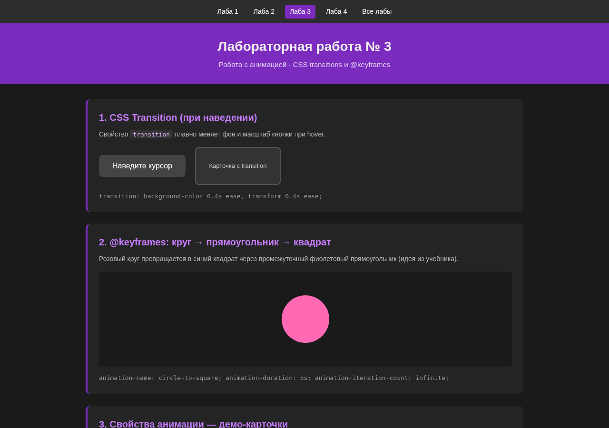
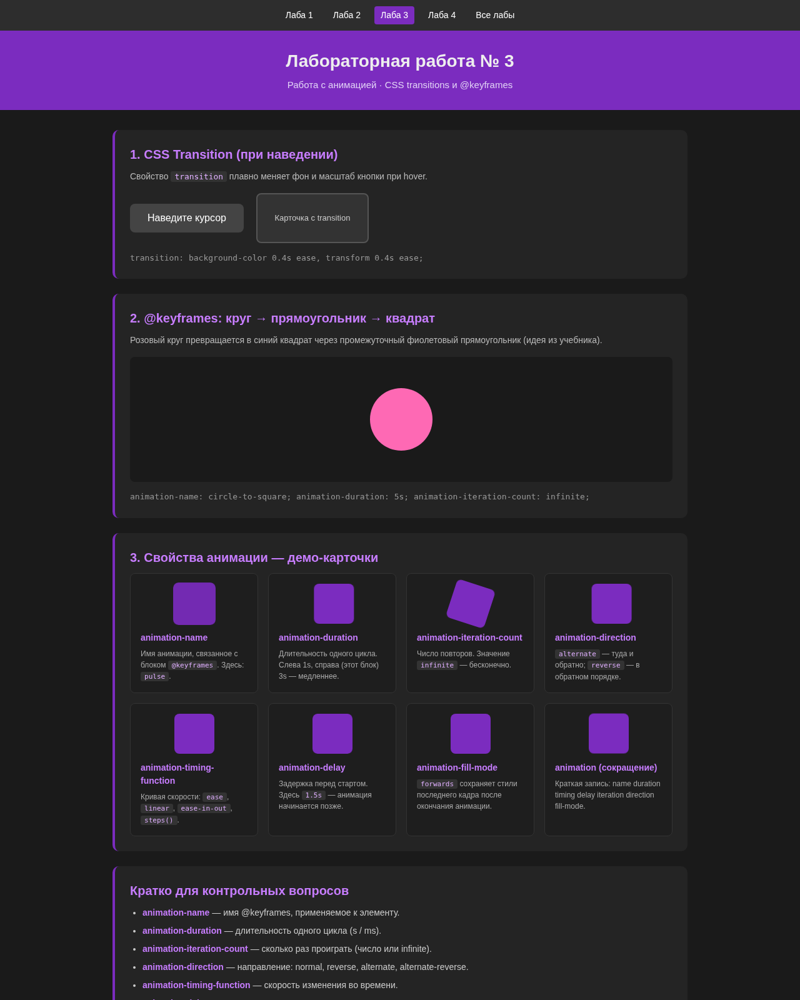

# Лабораторная работа № 3. Работа с анимацией

**Статус:** готово  
**Тема:** CSS transitions и @keyframes-анимации  
**Автор:** Артём Скопенков · группа ИС2-241-ОБ

🌐 [Открыть сайт](https://furfantom1331fur.github.io/Web-Design/lab3/) · [Все лабы](../index.html) · [Лаба 2](../lab2/index.html) · [Лаба 4](../lab4/index.html)

---

## О сайте

Демонстрационная страница по CSS-анимациям **без JavaScript**: переходы (transition) и ключевые кадры (@keyframes).

### Что есть на странице
- **CSS Transition** — плавное изменение `background-color` и `transform` при наведении
- **@keyframes circle-to-square** — розовый круг → фиолетовый прямоугольник → синий квадрат
- **Демо-карточки** свойств: `animation-name`, `duration`, `iteration-count`, `direction`, `timing-function`, `delay`, `fill-mode`
- Краткие подписи на русском для контрольных вопросов

### Как сделано
- HTML5 + CSS3, без JavaScript
- Акцент `#7b2cbf`, тёмная тема
- Навигация `.lab-nav` между лабораторными

### Файлы
- `index.html` — демо-страница
- `style.css` — стили и анимации
- `screenshots/` — скриншоты
- `Otchet_Lab3_Web-Dizayn.docx` — отчёт

---

## Скриншоты

### Transition и шапка

### Круг → квадрат

### Демо-карточки свойств

### Общий вид

> Если скриншоты-заглушки: живая страница доступна на GitHub Pages по ссылке выше.

---

## Отчёт

📄 [Otchet_Lab3_Web-Dizayn.docx](./Otchet_Lab3_Web-Dizayn.docx)
