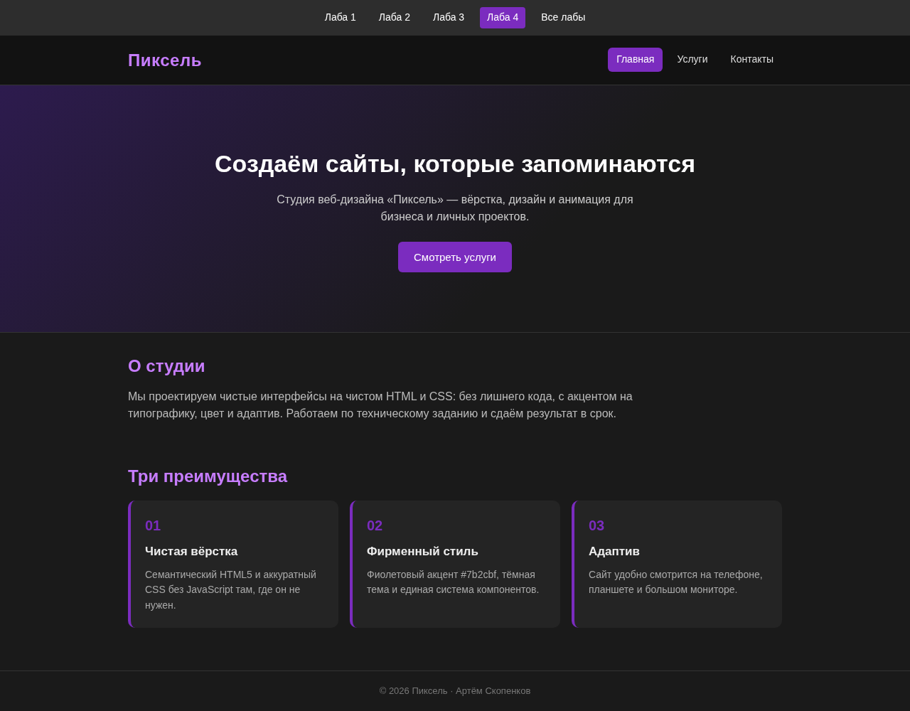
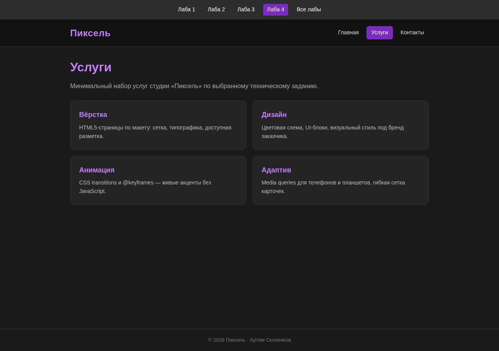
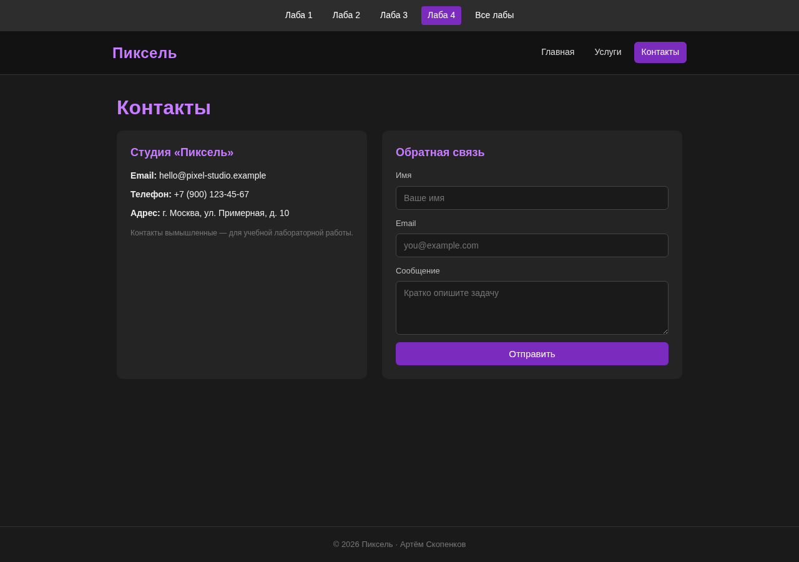
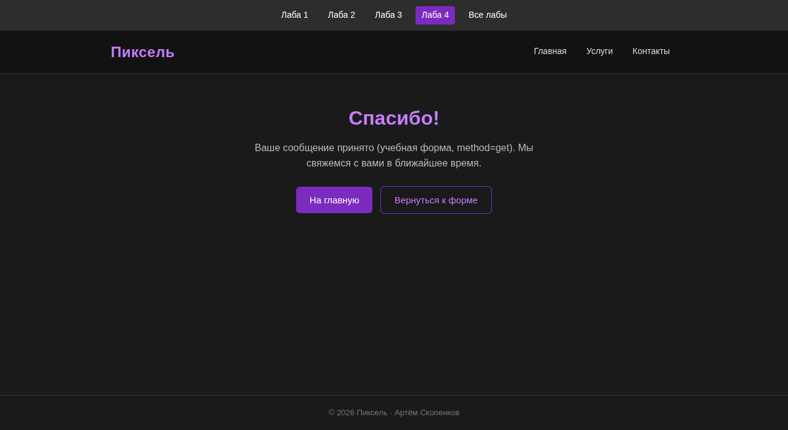

# Лабораторная работа № 4. Создание сайта по техническому заданию

**Статус:** готово  
**Тема:** сайт студии веб-дизайна «Пиксель»  
**Автор:** Артём Скопенков · группа ИС2-241-ОБ

🌐 [Открыть сайт](https://furfantom1331fur.github.io/Web-Design/lab4/) · [Все лабы](../index.html) · [Лаба 3](../lab3/index.html)

---

## Выбранный вариант (ТЗ)

Ссылка на варианты Яндекс.Диска из методички **недоступна (404)**.  
В качестве варианта выбран и реализован следующий вариант:

> **Сайт студии веб-дизайна «Пиксель» (HTML+CSS only):**
> - Не меньше 3 страниц: Главная, Услуги, Контакты
> - Общая шапка с названием и навигацией между страницами + lab-nav
> - Подвал с копирайтом «© 2026 Пиксель · Артём Скопенков»
> - Главная: hero-блок, краткое описание студии, 3 преимущества
> - Услуги: минимум 4 карточки услуг (вёрстка, дизайн, анимация, адаптив)
> - Контакты: блок с email/телефоном и HTML-форма обратной связи (`method=get`, `action=thanks.html`) + `thanks.html`
> - Единый `style.css`, адаптивная вёрстка (media queries), акцент `#7b2cbf`

---

## О сайте

Многостраничный учебный сайт студии **«Пиксель»**.

### Страницы
- `index.html` — главная (hero, о студии, 3 преимущества)
- `uslugi.html` — 4 карточки услуг
- `kontakty.html` — контакты + форма
- `thanks.html` — страница после отправки формы

### Как сделано
- HTML5 + CSS3, без JavaScript
- Тёмная тема, акцент `#7b2cbf`
- Адаптив через `@media`
- Навигация `.lab-nav` между лабораторными

### Файлы
- `index.html`, `uslugi.html`, `kontakty.html`, `thanks.html`
- `style.css` — общие стили
- `screenshots/` — скриншоты
- `Otchet_Lab4_Web-Dizayn.docx` — отчёт

---

## Скриншоты

### Главная

### Услуги

### Контакты

### Спасибо

> Если скриншоты-заглушки: живая страница на GitHub Pages по ссылке выше.

---

## Отчёт

📄 [Otchet_Lab4_Web-Dizayn.docx](./Otchet_Lab4_Web-Dizayn.docx)
